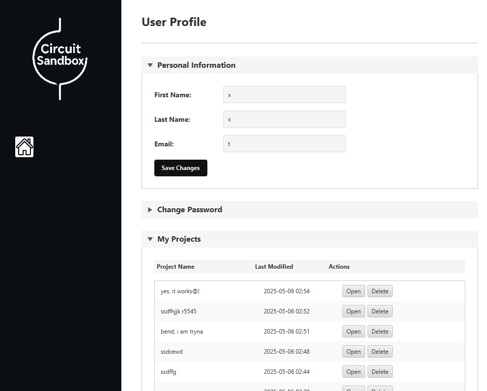
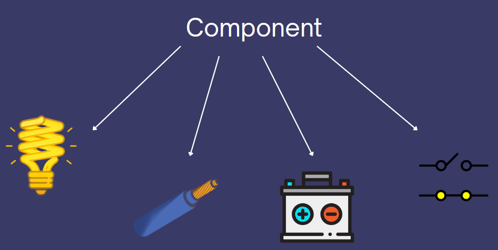

# ⚡ Circuit Simulator 311

A JavaFX-based drag-and-drop circuit simulation tool designed for interactive electrical learning and prototyping. Built for the CSC311 course, it supports real-time visualization of electrical flow, cloud-based project saving, and a user-friendly interface.

---

## 🛠 Features

- **Interactive Components**: Drag and drop batteries, lightbulbs, wires, and switches.
- **Real-Time Simulation**: Visualize power flow across connected components.
- **Smart Port System**: Components snap together using logical ports for clear connectivity.
- **Project Persistence**:
  - Save/load projects to Azure Blob Storage.
  - Project metadata and user accounts stored in MySQL.
- **Dark Mode & Grid Overlay**: Toggle visual preferences for cleaner UI.
- **Profile Management**: Update personal info and change passwords.
- **Guided Tutorial**: Learn how to build circuits with integrated tooltips and examples.

---

## 💻 Technologies Used

- **JavaFX** – UI and drag-and-drop interface  
- **MySQL** – User and project metadata persistence  
- **Azure Blob Storage** – Save circuit JSON files  
- **Gson** – JSON serialization of circuit layout  
- **FXML** – Declarative layout for views  
- **Java 21+** – Modern Java features (records, pattern matching)

---

## 🔐 Database Schema (MySQL)

**Users Table**
```sql
CREATE TABLE IF NOT EXISTS circuitUsers (
    id VARCHAR(200) PRIMARY KEY,
    email VARCHAR(200) UNIQUE,
    password VARCHAR(200),
    firstname VARCHAR(200),
    lastname VARCHAR(200),
    dob DATETIME DEFAULT CURRENT_TIMESTAMP
);
```

**Projects Table**
```sql
CREATE TABLE IF NOT EXISTS projects (
    id VARCHAR(200) PRIMARY KEY,
    name VARCHAR(100),
    description TEXT,
    user_id VARCHAR(200),
    created_at TIMESTAMP DEFAULT CURRENT_TIMESTAMP,
    last_modified TIMESTAMP DEFAULT CURRENT_TIMESTAMP,
    blob_reference VARCHAR(255)
);
```

---

## ☁️ Azure Blob Configuration

- **Container**: `circuitprojects`  
- **Blob Format**: JSON (circuit structure: components, wires, positions, connections)  
- Defined in: `BlobDbOpps.java`  
- Automatically creates container if missing.

---

## 🧪 Example Circuit Save Structure (JSON)

```json
{
  "components": [
    { "id": "bat1", "type": "Battery", "x": 120, "y": 240 },
    { "id": "bulb1", "type": "Lightbulb", "x": 300, "y": 240 }
  ],
  "wires": [
    {
      "startComponentId": "bat1",
      "startPortIndex": 1,
      "endComponentId": "bulb1",
      "endPortIndex": 0,
      "startX": 140, "startY": 250,
      "endX": 320, "endY": 250
    }
  ]
}
```

---

## 🚀 Getting Started

### Prerequisites
- Java JDK 21+
- IntelliJ IDEA (recommended)
- MySQL server (Azure-hosted preferred)


### Run Locally
1. Clone the repo:
   ```bash
   git clone https://github.com/your-repo/circuit-simulator.git
   ```
2. Set database credentials in `DbOpps.java`.
3. Set Azure credentials in `BlobDbOpps.java`.
4. Launch from `Login.java` or `mainmenu.fxml`.

---
## 📸 Screenshots

### ProfilePage


### Components



---
### Documentation
[View the Javadocs](docs/index.html)

---

### Links
https://www.youtube.com/watch?v=u7f78jTDppk


## Credits
* [Justin Derenthal](https://github.com/JderenthalCS)
* [Kevin Conaty](https://github.com/kkconaty23)
* [Esteban Sandoval](https://github.com/SandalCodez)
* [Mike Moradi](https://github.com/PracticalEscapement)
